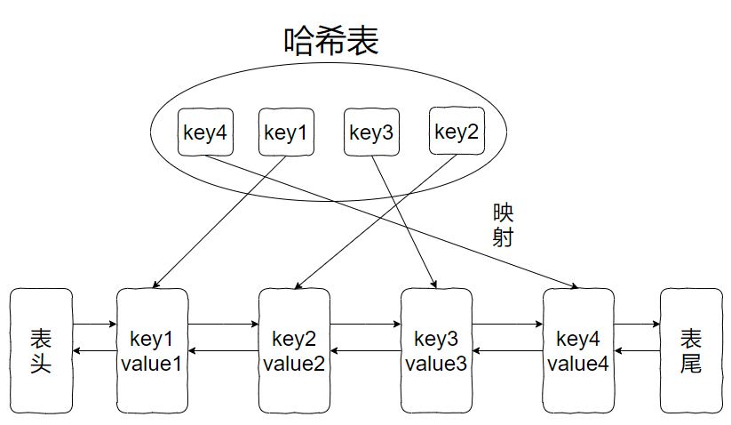

## 146. LRU 缓存
题目大意： 
请你设计并实现一个满足 LRU (最近最少使用) 缓存 约束的数据结构   
实现 LRUCache 类：  
LRUCache(int capacity) 以 正整数 作为容量 capacity 初始化 LRU 缓存  
函数 get 和 put 必须以 O(1) 的平均时间复杂度运行   
int get(int key) 如果关键字 key 存在于缓存中，则返回关键字的值，否则返回 -1    
void put(int key, int value) 如果关键字 key 已经存在，则变更其数据值 value ；如果不存在，则向缓存中插入该组 key-value 。如果插入操作导致关键字数量超过 capacity ，则应该 逐出 最久未使用的关键字   


## 思路
### 核心：双向链表：包含首、尾节点 + 哈希表  

### Get  
* map 中存在该 key，移除在链表中对应 key 的节点，把该节点添加到链表头节点，返回 key 的值  
* map 中不存在该 key，返回 -1  
### Put
* map 中存在该 key，更新 key 对应的节点 value，移除在链表中对应 key 的节点，把该节点作为链表头节点  
* map 中不存在该 key, 创建节点，把该节点作为列表头节点；判断链表长度，超出容量，移除链表尾节点

## 代码
```go
type Node struct {
    key, value int
    prev, next *Node
}

type LRUCache struct {
    head, tail *Node
    cache map[int]*Node
    capacity int
}


func Constructor(capacity int) LRUCache {
    return LRUCache{
        cache: make(map[int]*Node),
        capacity: capacity,
    }
}

func (this *LRUCache) Get(key int) int {
    if node, ok := this.cache[key]; ok {
        this.removePrevNode(node)
        this.addToFront(node)
        return node.value
    }
    return -1
}

func (this *LRUCache) Put(key int, value int)  {
    if node, ok := this.cache[key]; ok {
        node.value = value
        this.removePrevNode(node)
        this.addToFront(node)
        return
    }
    // node not exist
    node = &Node{key: key, value: value}
    this.cache[key] = node
    this.addToFront(node)
    if len(this.cache) > this.capacity {
        delete(this.cache, this.tail.key)
        this.removePrevNode(this.tail)
    }
}

func (this *LRUCache) addToFront(node *Node) {
    // handle node
    node.prev = nil
    node.next = this.head

    // handle head
    if this.head != nil {
        this.head.prev = node
    }
    this.head = node

    // handle tail
    if this.tail == nil {
        this.tail = node
        this.tail.next = nil
    }
}

func (this *LRUCache) removePrevNode(node *Node) {
    if node == this.head {
        this.head = node.next
        if node.next != nil {
            node.next.prev = nil
        }
        node.next = nil
        return
    }
    if node == this.tail {
        this.tail = node.prev
        node.prev.next = nil
        node.prev = nil
        return
    }
    // neither head nor tail
    node.next.prev = node.prev
    node.prev.next = node.next
}
```
